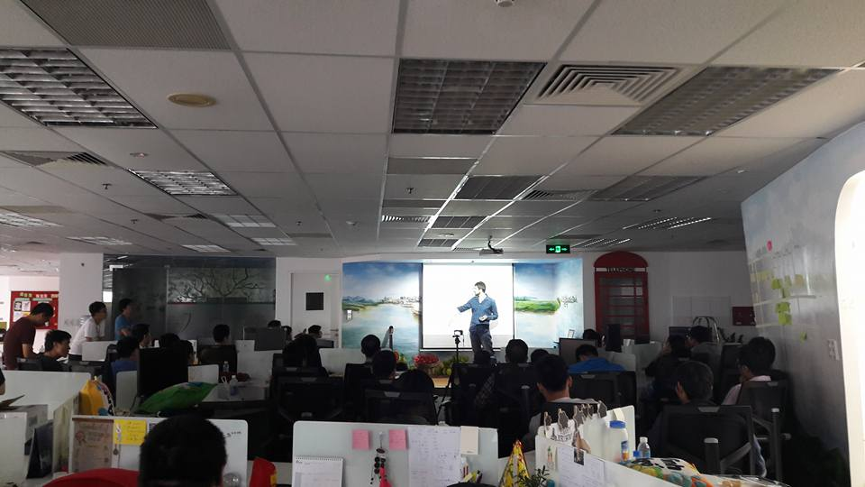
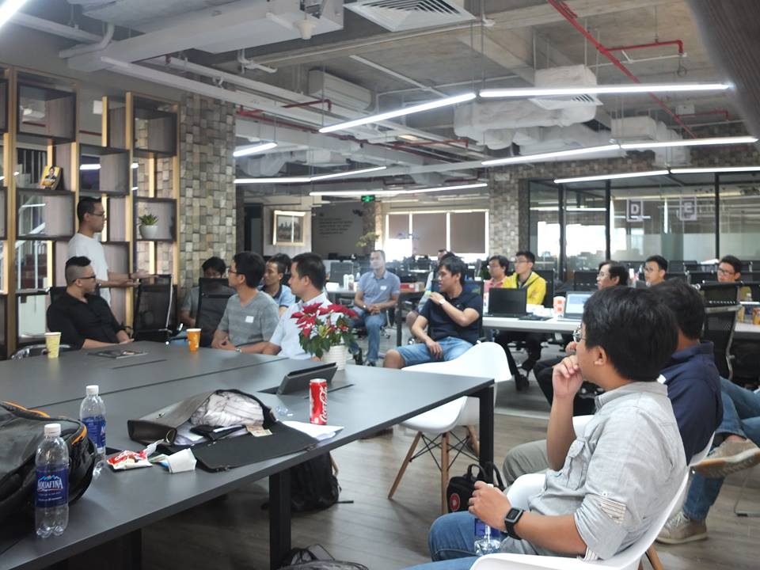
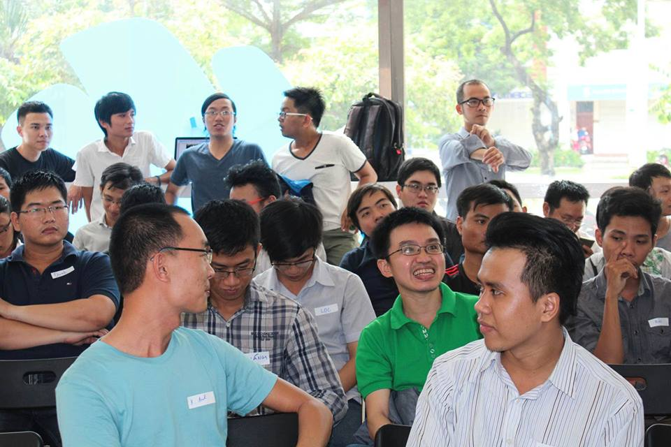
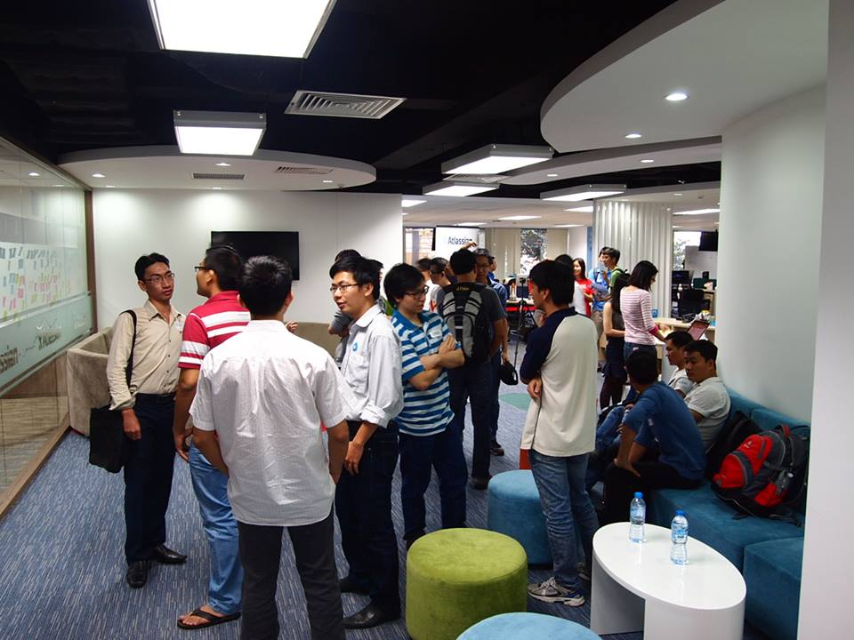

# Grokking Meetups

You'll find list of our Grokking meetups from the beginning. For a list of meetup topics to be selected for presentation, please head to "Issues".

## Meetup 09 - March 29, 2016

* **Building a realtime & offline editing service from scratch with Couchbase** - Vu Nguyen, CTO @ Liti Book (Vietnamese) 
* **Secure Coding** - Tran Anh Tuan, Security Engineer @ VietABank (Vietnamese)
* **When a Java guy goes Ruby** - Jonathan Bardin, Technical Architect @ TINYpulse (English)

##### Info
* Sponsor: TINYpulse
* [Event](https://www.facebook.com/events/950369215012812/) | [Photos](https://www.facebook.com/media/set/?set=a.1031087110292590.1073741837.764146283653342)

## Meetup 08 - A Date With DevOps - Feb 27, 2016

* **Docker Internals** - Vincent De Smet
* **DevOps at Hoiio** - Hieu @ Hoiio
* **Docker management with Ansible** - Thinh @ ChoTot

##### Info

* Sponsor: Chotot.vn (Venue)
* [Event](https://www.facebook.com/events/1651426405122455/) | [Photos](https://www.facebook.com/media/set/?set=a.1006854916049143.1073741835.764146283653342&type=3)

## Meetup 6 - Grokking Coding Challenge - 6/12/2015

* Last event of the year, a 3-hour coding challenge (with preliminary rounds done online)
* **Challenge:** Build a stripped-down version of Redis database in 3 hours.
* **Sponsors:** Dreamplex (Venue), Hoiio and MySQUAR (Food & Prizes)

[Photos](https://www.facebook.com/media/set/?set=a.961722197229082.1073741832.764146283653342&type=1&l=06208f75a2) |
[Event Link](https://www.facebook.com/events/423555677848446/)

## Meetup 5

##### Talks

* **Android from Linux perspective and Root on Android**, Tran Ngoc Thuan (Android Team Lead, VNPT MEDIA)
* **Phanbook - Open source library**, Tran Duy Thien (PHP Developer)
* **Coding standard and performance optimization**, Le Thanh Xuan (Senior Developer, Atlassian)

##### Info
* [Facebook Event](https://www.facebook.com/events/764117887031387/)
* Venue Sponsor: Air Lounge (Silicon Straits Saigon)

## Meetup 4

* [Facebook Event](https://www.facebook.com/events/477054909126245/)
* Sponsors: Silicon Straits Saigon (Venue)

##### Talks

* **Technology Stack at MySQUAR**, Khac Anh (Software Engineer, MySQUAR)
* **Web 3.0: Offline first with CouchDB**, Hervé Vu (Co-Founder & former CTO, Linked Senior)
* **Using Redis in building social networks with large user base**, Chau Nguyen Nhat Thanh (Technical Manager, VNG)
* **How to implement Flux Architecture on mobile (Native)**, Pham Duc Huy (Software Engineer, Lozi.vn)
* **HtmlJs - JavaScript MVVM framework**, Nhan (Software Engineer, Play Studio)

## Meetup 3 - Real-time Data Pipeline & Real-world Microservice Architecture

* [Facebook Event](https://www.facebook.com/events/864085826964097/)
* Venue Sponsor: Sentifi

##### Talks

* **Migrating to service-oriented architecture at LOZI**, Nguyen Thanh Trung (C​TO/Co-founder of LOZI)
* **Building Real-time Data Pipeline at FPT**, Nguyen Tan Trieu (T​echnical lead and full-stack engineer at FPT)

## Meetup 2 - Build big things from small components

* [Facebook Event](https://www.facebook.com/events/321724054703790/)
* Venue Sponsor: Officience

##### Talks

* **Building microservices web application using Akka & Scala**, Binh Nguyen (Director of Engineering, Anduin Transactions)
* **A journey with Artificial Neural Network (ANN) in solving real-world problems**, Steven Goh (Founder, Nubela Corp)

## Meetup 1 - Kick-off Talk

This is our first meetup, starting off Grokking program.Sponsors: Atlassian (Venue). [FB Event](https://www.facebook.com/events/560196397413884/).

**The absolute minimum every software developer needs to know about database indexes**, Cedric Chin (Floating Cube Studios). [Slides](https://speakerdeck.com/ejamesc/the-absolute-minimum-every-software-developer-needs-to-know-about-database-indexes)

> If you’re a software developer, it’s nearly guaranteed that you’ve worked with a database before. But what happens when you find your queries running slowly? How do you debug bad database performance? The truth is, most of us don’t know much about RDMS internals: we just insert and retrieve data and pray that our queries run quickly enough.
>
> The good news? It turns out that the only thing a developer really needs to understand about relational databases is how their indexes work. Most of the performance characteristics of modern RDMSes may be explained through the database index. This talk introduces the data structures these indexes use, how these structures determine query performance, how to read a query plan, and what to think about when designing indexes for your database schema.

**How we built our data-warehouse and analytics infrastructure at Viki**, Huy Nguyen (Viki). [Slides](http://www.slideshare.net/nvquanghuy/grokking-engineering-data-analytics-infrastructure-at-viki-huy-nguyen)

> At Viki we collect and analyze over 60M user-generated data points everyday. This talk goes into deep technical and architecture design to share about the infrastructure, the different tools and processes we’ve built with our analytics system. Specifically we’ll talk about how we collect, process data and present data in both real-time and batch-processing manners.
>
> The current system is capable of supporting a variety of business and product needs: automated business reporting, A/B testing, cohort analysis, funnel analysis, recommendation engine, etc.
>
> Technology stack: Ruby, Python, R, NodeJS, Golang, PostgreSQL, Java, Storm, Hadoop with Apache Hive.
